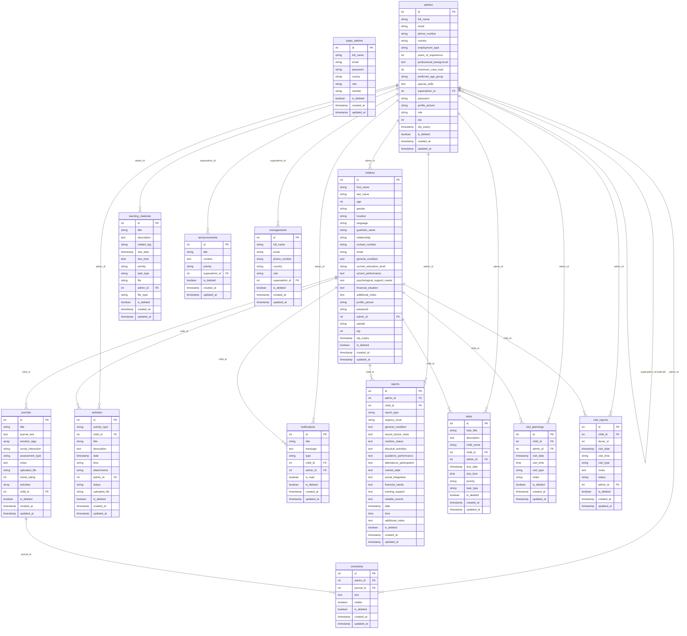

# Entity Relationship Diagram

```mermaid
erDiagram
    super_admins {
        int id PK
        string full_name
        string email
        string password
        string county
        string role
        string number
        boolean is_deleted
        timestamp created_at
        timestamp updated_at
    }

    admins {
        int id PK
        string full_name
        string email
        string phone_number
        string country
        string employment_type
        int years_of_experience
        text professional_background
        int maximum_case_load
        string preferred_age_group
        text special_skills
        int superadmin_id FK
        string password
        string profile_picture
        string role
        int otp
        timestamp otp_expiry
        boolean is_deleted
        timestamp created_at
        timestamp updated_at
    }

    children {
        int id PK
        string first_name
        string last_name
        int age
        string gender
        string location
        string language
        string guardian_name
        string relationship
        string contact_number
        string email
        text general_condition
        string current_education_level
        text school_performance
        text psychological_support_needs
        text financial_situation
        text additional_notes
        string profile_picture
        string password
        int admin_id FK
        string upload
        int otp
        timestamp otp_expiry
        boolean is_deleted
        timestamp created_at
        timestamp updated_at
    }

    journals {
        int id PK
        string title
        text journal_text
        array emotion_tags
        string social_interaction
        string assessment_type
        text notes
        string uploaded_file
        int mood_rating
        array activities
        int child_id FK
        boolean is_deleted
        timestamp created_at
        timestamp updated_at
    }

    comments {
        int id PK
        int admin_id FK
        int journal_id FK
        text text
        boolean visible
        boolean is_deleted
        timestamp created_at
        timestamp updated_at
    }

    activities {
        int id PK
        string activity_type
        int child_id FK
        string title
        text description
        timestamp date
        string time
        string attachments
        int admin_id FK
        string status
        string uploaded_file
        boolean is_deleted
        timestamp created_at
        timestamp updated_at
    }

    learning_materials {
        int id PK
        string title
        text description
        string related_tag
        timestamp due_date
        time due_time
        string priority
        string task_type
        string file
        int admin_id FK
        string file_type
        boolean is_deleted
        timestamp created_at
        timestamp updated_at
    }

    notifications {
        int id PK
        string title
        text message
        string type
        int child_id FK
        int admin_id FK
        boolean is_read
        boolean is_deleted
        timestamp created_at
        timestamp updated_at
    }

    reports {
        int id PK
        int admin_id FK
        int child_id FK
        string report_type
        string urgency_level
        text general_condition
        text recent_doctor_visits
        text nutrition_status
        text physical_activities
        text academic_performance
        text attendance_participation
        text mental_state
        text social_integration
        text financial_needs
        text existing_support
        text notable_events
        timestamp date
        time time
        text additional_notes
        boolean is_deleted
        timestamp created_at
        timestamp updated_at
    }

    tasks {
        int id PK
        string task_title
        text description
        string child_name
        int child_id FK
        int admin_id FK
        timestamp due_date
        time due_time
        string priority
        string task_type
        boolean is_deleted
        timestamp created_at
        timestamp updated_at
    }

    visit_plannings {
        int id PK
        int child_id FK
        int admin_id FK
        timestamp visit_date
        time visit_time
        string visit_type
        string notes
        boolean is_deleted
        timestamp created_at
        timestamp updated_at
    }

    visit_reports {
        int id PK
        int child_id FK
        int donor_id
        timestamp visit_date
        string visit_time
        string visit_type
        text notes
        string status
        int admin_id FK
        boolean is_deleted
        timestamp created_at
        timestamp updated_at
    }

    announcements {
        int id PK
        string title
        text content
        string priority
        int superadmin_id FK
        boolean is_deleted
        timestamp created_at
        timestamp updated_at
    }

    managements {
        int id PK
        string full_name
        string email
        string phone_number
        string country
        string role
        int superadmin_id FK
        boolean is_deleted
        timestamp created_at
        timestamp updated_at
    }

    %% Relationships
    admins ||--o{ admins : "superadmin_id (self-ref)"
    admins ||--o{ children : "admin_id"
    admins ||--o{ activities : "admin_id"
    admins ||--o{ learning_materials : "admin_id"
    admins ||--o{ notifications : "admin_id"
    admins ||--o{ reports : "admin_id"
    admins ||--o{ tasks : "admin_id"
    admins ||--o{ visit_plannings : "admin_id"
    admins ||--o{ visit_reports : "admin_id"
    admins ||--o{ comments : "admin_id"
    admins ||--o{ announcements : "superadmin_id"
    admins ||--o{ managements : "superadmin_id"

    children ||--o{ journals : "child_id"
    children ||--o{ activities : "child_id"
    children ||--o{ notifications : "child_id"
    children ||--o{ reports : "child_id"
    children ||--o{ tasks : "child_id"
    children ||--o{ visit_plannings : "child_id"
    children ||--o{ visit_reports : "child_id"

    journals ||--o{ comments : "journal_id"
```
